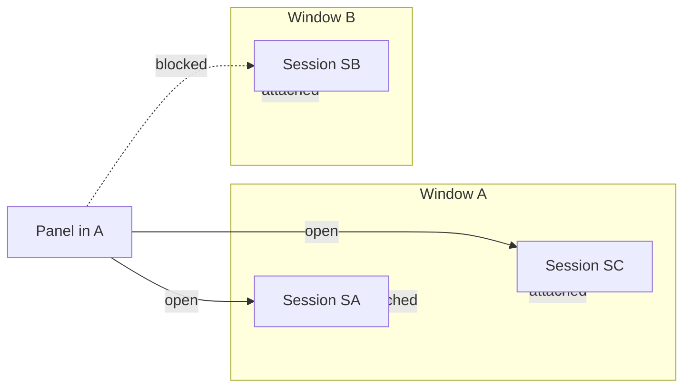
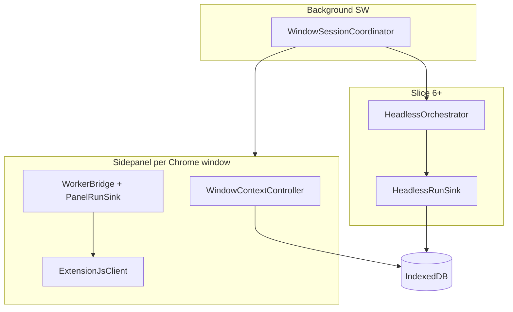

# Window-Native Session Isolation — Detailed Plan

**Status:** Approved (grill complete, 2026-07-08) — **partially superseded 2026-07-09**  
**Delivery:** Test-driven vertical slices (RED → GREEN → REFACTOR)  
**Related:** extension-js v0.15.3 Plan B per-window isolation (`@pi-oxide/extension-js`)

## Superseding product lock (2026-07-09)

These rules override grill answers that assumed **offscreen / panel-close survival** (notably Q5 `split_ship` Slice 6–7, Q13 `stay_b_headless`, B5/B6 as originally written, Slice 6–7).

| Rule | Meaning |
|------|---------|
| **Close side panel** | Live agent runs in that panel **stop**. Session rows may remain in IDB; workers do not outlive the panel. **Not a bug. Not a future milestone.** |
| **In-panel “background”** | While the panel **stays open**, N sessions may run concurrently; only the foreground session is the chat UI. Switching sessions does not stop other in-panel runs. |
| **Offscreen host** | **Out of product scope.** Do not ship “keep running after panel close.” Legacy `headless-boot.js` / offscreen code is not a delivery target. |
| **Parallel** | Still allowed: multiple windows (each with an open panel) and/or multiple sessions inside one open panel. |

Historical grill text below is retained for context; where it conflicts with this lock, **this lock wins**.

---

## 1. Background

### 1.1 What extension-js already does

extension-js implements **VSCode-style per-window isolation** at the **runtime** layer (commit `83d32c5`, Plan B):

| Mechanism | Location | Behavior |
|-----------|----------|----------|
| Window capture | `extension-session.ts` `bindTabContext()` | `chrome.windows.getCurrent()` → `windowId` |
| Active-tab pointer | `tab-tracker.ts` | Per-session `chrome.tabs.*` listeners filtered by `windowId` |
| Content-script gate | `executeContentScriptCommand` | `E_TAB_NOT_OWNED` if tab not in session window |
| Parity-tool gate | `tab-ownership.ts` | Blocks cross-window `sendMessage` / `scripting.*` |
| Abort signal | `ExtensionSession` instance | No module-global `AbortController` race |

Browsergent [`ExtensionJsClient`](src/sidepanel/extension-js-client.ts) already owns **one `ExtensionSession` per sidepanel document**.

### 1.2 What Browsergent still lacks

[`SessionController`](src/controllers/session-controller.ts) persists a **single global** `activeSessionId` in IndexedDB. All sidepanel documents load the same chat session even though each panel's extension-js runtime is window-scoped.

**This plan** aligns **chat/agent session persistence and lifecycle** with extension-js window isolation.

---

## 2. Grill session — all 25 questions

Each question includes context, options, recommended answer, and **your decision**.

---

### Batch 1 — Core attachment & ship scope

#### Q1. 窗口合并后，两个 chat session 怎么挂到幸存窗口？

**场景：** Window A 绑定 Session SA（foreground），Window B 绑定 Session SB。用户把 B 的所有 tab 拖进 A，B 被销毁。

| Option | Description |
|--------|-------------|
| **both_on_survivor** ★推荐 | SA 和 SB 都归属幸存窗口 A；SA 保持 foreground，SB 变 background；panel 里可切换（同窗口） |
| sb_orphan | SB 与窗口解绑，变成游离 session |
| sb_discard | 合并时丢弃 SB |

**✅ 你的选择：** `both_on_survivor`

---

#### Q2. 同一窗口内，用户手动切换 session，是否改写 windowBindings？

**场景：** Window A 默认打开 SA。用户在 session 列表里点 SB。

| Option | Description |
|--------|-------------|
| rebind_window | 切换即更新 windowBindings[A]=SB |
| view_only | 切换只是临时查看，重开 panel 回到 SA |
| prompt_on_conflict | 切换时弹确认 |

**✅ 你的回答（自定义规则，取代上述选项）：**

> 这是 **N↔N 问题**，但规则要显式化：
>
> - 每个 session 的状态只有 **Attached(window reference)**。
> - **一个 window 可以挂 N 个 session；一个 session 只能挂一个 window。**
> - 用户 **只能** view/interact 那些 `session.windowId === 当前 panel 所在 windowId` 的 session。
> - 例：session SB 挂在 Window B 且正在 B 里跑 agent；用户在 Window A 的列表里点 SB → **禁止打开**，提示「正在另一窗口运行/属于另一窗口」。
> - **一个 window 只能打开绑定到它的 session**（不是全局随便点）。

---

#### Q3. 多窗口各跑一个 agent，是否允许并行？

**场景：** A 的 panel 在后台跑着 agent；用户切到 B 又点 Run。

| Option | Description |
|--------|-------------|
| **parallel_ok** ★推荐 | 每窗口独立并行（各 panel 自有 worker；headless 后 offscreen 也可并行） |
| one_global | 全局只允许一个 active run |
| parallel_warn | 允许并行但弹警告 |

**✅ 你的选择：** `parallel_ok`

---

#### Q4. 窗口已关闭/合并后，session 列表的 window badge 显示什么？

| Option | Description |
|--------|-------------|
| **closed_plus_survivor** ★推荐 | 合并过的 session 显示幸存窗口 ID；仅「窗口关闭且未合并」显示 `Window {id} (closed)` |
| always_background_chip | background 统一显示「Background」，不显示数字 |
| keep_original_id | 永远保留创建时的 windowId |

**✅ 你的选择：** `closed_plus_survivor`

---

#### Q5. Headless continuation 的 v1 交付边界？

| Option | Description |
|--------|-------------|
| **split_ship** ★推荐 | v1 先交付 Slice 1–5；Slice 6–7 headless 单独里程碑；README 暂保留「无 headless」直到 Slice 6 完成 |
| all_or_nothing | 必须 7 个 slice 一起上线 |
| headless_mvp_stop | v1 只做 panel 关闭 → 优雅 stop（与 headless_continue 矛盾） |

**✅ 你的选择：** `split_ship`

---

### Batch 2 — Attachment cardinality & headless

#### Q6. Session ↔ Window 的「Attached」是哪种 N:N？

| Option | Description |
|--------|-------------|
| **one_session_one_window** ★推荐 | 每个 session 恰好 attached 一个 windowId（1:1 from session side） |
| true_nn | 一个 session 可挂多个 window |
| birth_window_sticky | 保留 birthWindowId + operationalWindowId |

**✅ 你的选择：** `one_session_one_window`

---

#### Q7. 全局 session 列表里，点「属于别的窗口」的 session 怎么反馈？

| Option | Description |
|--------|-------------|
| **block_with_message** ★推荐 | 完全禁止打开；toast 提示切换到对应窗口；可显示 running 指示但不可点 |
| readonly_preview | 允许只读查看历史 |
| detach_and_open | 提示解绑并在本窗口打开 |

**✅ 你的选择：** `block_with_message`

---

#### Q8. Headless 续跑时，session 的 Attached 指向谁？

| Option | Description |
|--------|-------------|
| attach_offscreen_virtual | attached 到虚拟 host |
| keep_window_b_until_done | 仍 attached 到 windowId=B |
| rebind_on_adopt | panel 关闭瞬间 rebind 到最后聚焦窗口 |

**✅ 你的回答（自定义规则）：**

> **每个 session 必须有关联的 ACTIVE window ID**（指 Chrome 窗口仍存在，见 Q12）。  
> Headless 不改变附着：关 sidepanel 但 Window B 还在 → `SB.windowId` 仍是 B；offscreen 只是执行宿主，不是 attachment 目标。

---

#### Q9. 合并后 SB 变成 background 且 windowId→A，用户能在 A 的 panel 打开 SB 吗？

**✅ 你的回答：** 沿用 Q2/Q6 规则——合并 rebind 后 SB attached A，**可以在 A 打开**（与 B 时不能在 A 打开相反）。若 headless run 占用中，打开 = subscribe 镜像（Slice 7）。

---

#### Q10.「新建 session」按钮的行为？

**✅ 你的回答：** 沿用 Q2 规则——新建 SC attached 当前 window；**一 window 可多 session**。

---

### Batch 3 — Same-window switch & active window definition

#### Q11. 同一窗口 A 挂了 SA、SB，用户能在 A 的 panel 里切换吗？

**✅ 你的回答（自定义规则）：**

> User can **ONLY** view/interact with the session whose **window reference is the current window**.  
> 合并后 SA、SB 都 attached A → 在 A 内可以切换。在 A 不能操作 attached B 的 session。

---

#### Q12.「ACTIVE window ID」的精确定义？

| Option | Description |
|--------|-------------|
| **window_exists** ★推荐 | Chrome 窗口仍存在即可（不要求 focused）；关 sidepanel 不算丢 window；合并/关窗才必须 rebind |
| window_focused | 必须是聚焦窗口 |
| window_has_panel | 必须 sidepanel 文档还开着 |

**✅ 你的选择：** `window_exists`

---

#### Q13. 只关 sidepanel、Chrome 窗口还在——session 附着与 headless？

| Option | Description |
|--------|-------------|
| **stay_b_headless** ★推荐 | windowId 保持 B；offscreen 续跑；重开 B 的 sidepanel 可 subscribe 回 SB |
| stay_b_block_all | headless 期间任何 panel 都不能打开 SB |
| detach_on_panel_close | 关 panel 即 detach（违反 active window 规则） |

**✅ 你的选择：** `stay_b_headless`

---

#### Q14. 在 Window A 点「新建 session」后，旧的 SA 怎么办？

| Option | Description |
|--------|-------------|
| **sa_stays_attached_a** ★推荐 | SA 仍 attached A，变 background；panel 切到 SC；列表里都可切回 |
| sa_auto_detach | SA 无 window（违反规则） |
| sa_delete_if_empty | 空 session 自动删除 |

**✅ 你的选择：** `sa_stays_attached_a`

---

#### Q15. 列表里「属于另一窗口」的判定条件？

| Option | Description |
|--------|-------------|
| **attached_elsewhere** ★推荐 | `session.windowId !== 当前 panel windowId` 即不可打开（与是否 running 无关）；running 时额外显示点 |
| only_when_agent_running | 仅 running 时拦截 |
| running_locks_globally | 全局 run 占用即不可开 |

**✅ 你的选择：** `attached_elsewhere`

---

### Batch 4 — Split/merge timing & interact scope

#### Q16. Tab 拖出新窗口时，新 session 何时创建？

| Option | Description |
|--------|-------------|
| **on_panel_open** ★推荐 | 首次打开新窗口 sidepanel 时 create + attach |
| on_split_event | split 瞬间预建空 session |
| inherit_parent | 继承父窗口 session（已否决） |

**✅ 你的选择：** `on_panel_open`

---

#### Q17. 合并中途：B 的 agent headless 跑着，tabs 并入 A，B 销毁

| Option | Description |
|--------|-------------|
| **rebind_continue** ★推荐 | `SB.windowId` B→A + `extension-js.rebindWindow(A)`，run 不中断 |
| stop_and_persist | 合并时 graceful stop |
| forbid_merge_while_running | 不现实 |

**✅ 你的选择：** `rebind_continue`

---

#### Q18. 跨窗口时「不可 interact」包括哪些操作？

| Option | Description |
|--------|-------------|
| **block_all_mutations** ★推荐 | 禁止 hydrate、Run、Steer、切换 active、删除；列表仅元数据+badge |
| block_run_only | 允许只读 hydrate |
| block_switch_only | 仅禁止设为 active |

**✅ 你的选择：** `block_all_mutations`

---

#### Q19. Headless 后用户重开 B 的 sidepanel，默认显示什么？

| Option | Description |
|--------|-------------|
| **auto_subscribe_sb** ★推荐 | 自动加载 SB 并 subscribe runEvent |
| last_local_ui_state | 恢复 panel 本地 UI |
| picker_if_multiple | 多 session 时弹选择器 |

**✅ 你的选择：** `auto_subscribe_sb`

---

#### Q20. TDD slice 优先级要不要按新规则重排？

| Option | Description |
|--------|-------------|
| **binding_before_list** ★推荐 | Slice1 加跨窗拦截测；Slice2 两窗 E2E；Slice5 列表 disabled+badge；headless 最后 |
| list_first | 先做列表 UX |
| headless_first | 先做 Slice 6 |

**✅ 你的选择：** `binding_before_list`

---

### Batch 5 — Settings, files, ship gate

#### Q21. Provider / API Key 设置是否跨窗口共享？

| Option | Description |
|--------|-------------|
| **global_settings** ★推荐 | 全局共享 |
| per_window_settings | 每窗口独立 |

**✅ 你的选择：** `global_settings`

---

#### Q22. Files / OPFS 是否跨 session、跨窗口共享？

| Option | Description |
|--------|-------------|
| **global_files_v1** ★推荐 | v1 保持全局；标为 known limitation |
| per_session_files | 按 sessionId 分目录 |
| per_window_files | 按 windowId 分目录 |

**✅ 你的选择：** `global_files_v1`

---

#### Q23. 在 Window A 的列表里删除 attached 到 B 的 session？

| Option | Description |
|--------|-------------|
| **block_delete_too** ★推荐 | 禁止；提示在所属窗口删除 |
| allow_delete_from_list | 允许全局删 |
| allow_if_not_running | 非 running 可删 |

**✅ 你的选择：** `block_delete_too`

---

#### Q24. 跨窗拦截提示文案语言？

| Option | Description |
|--------|-------------|
| **english_ui** ★推荐 | 与现有 UI 一致，英文 |
| chinese_ui | 中文 |
| bilingual | 中英双语 |

**✅ 你的选择：** `english_ui`  
**示例文案：** *"This session belongs to window {id}. Switch to that window to open it."*

---

#### Q25. 这轮 grill 是否够开工？

| Option | Description |
|--------|-------------|
| **update_plan_go** ★ | 共识已够，开始 Slice 1 TDD |
| one_more_batch | 还要第 6 批 |
| pivot_discuss | 重大分歧 |

**✅ 你的选择：** `update_plan_go`

---

## 3. Locked product rules (summary)

### 3.1 Attachment model

```
1 session  →  exactly 1 windowId  (Chrome window must still exist)
1 window   →  N sessions
panel      →  may only open sessions where session.windowId === panel.windowId
```



### 3.2 Lifecycle table

| Event | Behavior |
|-------|----------|
| **Split** | Source keeps session(s). New session **only on first sidepanel open** in new window. |
| **Merge** | SA + SB both on survivor A; SA foreground, SB background; `SB.windowId` rebinds. In-panel runs continue only while their hosting panel document is still open. |
| **New session (+)** | SC attached current window; old sessions stay attached same window (background list / optional concurrent run). |
| **Panel close** (window may still exist) | **All runs in that panel stop (by design).** Stored session data may remain; reopen hydrates chat from IDB, does not resume a live worker. |
| **Parallel agents** | Allowed per open panel / per window (N concurrent in-panel sessions). |

### 3.3 Cross-window UX

- Global flat session list with window badge.
- Rows where `session.windowId !== panel.windowId`: **disabled**, click → English toast, **no** hydrate/run/steer/delete.
- Running agent: extra indicator on row; still not openable from wrong window.

### 3.4 Data scope (v1)

| Data | Scope |
|------|-------|
| Chat sessions | Per `windowId` attachment + global list |
| Settings / API keys | Global |
| Files / OPFS | Global (known limitation) |

### 3.5 Ship phases

| Phase | Slices | Notes |
|-------|--------|--------|
| **Product** | 1–5 (+ in-panel multi-session) | Multi-window binding, list UX, concurrent in-panel runs |
| **Cancelled** | old Slice 6–7 offscreen survival | Panel-close keep-alive is out of scope |

---

## 4. Behavior contract for tests (Irving)

| ID | Observable | Forbidden |
|----|------------|-----------|
| B1 | Two windows → two independent chat sessions | Shared global `activeSessionId` |
| B2 | Split + first panel open in new window → fresh session | Inheriting parent chat |
| B3 | Merge → SA foreground, SB background on survivor, `SB.windowId` updated | Deleting SB |
| B4 | Global list + badges; other-window rows disabled | Opening cross-window session |
| B4b | Click other-window row → English block, no hydrate | Read-only preview |
| B5 | **In-panel:** switch away from running session → prior run may continue while panel open; **close panel → run stops** | Treating panel-close stop as a defect; requiring offscreen |
| B6 | Reopen **same window's** panel → hydrate stored session (no live run if panel was closed) | Open from wrong window |
| B7 | Merge while panels open → rebind; runs only continue if hosting panel still open | Expecting run to survive closed panel |

**Test surfaces (black-box):** `SessionController`, `WindowSessionCoordinator` public API, sidepanel `data-testid`, Playwright two-window, extension-js `init({ windowId })` / `rebindWindow()`.

**Forbidden in tests:** asserting `TabTracker` internals; mocking away `E_TAB_NOT_OWNED`; weakening assertions.

---

## 5. Data model changes

### 5.1 SessionData

```typescript
interface SessionData {
  id: string;
  windowId: number;           // required attachment
  lifecycle: "foreground" | "background";
  messages: ChatMessage[];
  trace: AgentTraceEntry[];
  diagnostics: AgentDiagnosticEvent[];
  timestamp: number;
  title?: string;
  customTitle?: string;
  messageCount: number;
}
```

### 5.2 SessionMeta

```typescript
interface SessionMeta {
  /** Per-window which session the panel last had open (1 window : N sessions) */
  panelActiveSession: Record<string, string>; // windowId string → sessionId
  headlessRuns?: Record<string, HeadlessRunRef>; // Slice 6+
  /** Legacy — migrate to panelActiveSession on first load */
  activeSessionId?: string;
}
```

### 5.3 SessionListItem (UI)

```typescript
interface SessionListItem {
  id: string;
  title: string;
  timestamp: number;
  messageCount: number;
  windowId: number | null;
  windowLabel: string;       // "Window 4821" | "Window 4821 (closed)"
  lifecycle: "foreground" | "background";
  openable: boolean;         // false when session.windowId !== panel.windowId
  running?: boolean;
}
```

### 5.4 SessionController API (new / changed)

| Method | Purpose |
|--------|---------|
| `resolveOrCreateForWindow(windowId)` | First panel open in window: load or create default session |
| `createSessionAttachedTo(windowId)` |「+ New session」 |
| `canOpenSession(sessionId, panelWindowId)` | Cross-window guard |
| `saveForSession(sessionId, snapshot)` | Replace global save path |
| `rebindSessionWindow(sessionId, newWindowId)` | Merge |
| `listSessions(panelWindowId)` | Global list + `openable` per row |

---

## 6. Architecture



**New files (planned):**

| File | Role |
|------|------|
| `src/sidepanel/window-context-controller.ts` | Capture `windowId`, session open guards |
| `src/background/window-session-coordinator.ts` | Split/merge/focus, panel register, adoptRun |
| `src/headless/index.ts` + `headless.html` | Slice 6 offscreen host |
| `src/controllers/run-event-sink.ts` | Panel / Headless / Subscriber sinks |

---

## 7. TDD vertical slices

**Method:** One behavior → failing test → minimal pass → refactor. No horizontal「先写完全部测试」.

### Slice 1 — Per-window binding + open guard (B1, B4b)

**RED:** `tests/unit/window-session-binding.spec.ts`

- `resolveOrCreateForWindow` → distinct ids per window
- `saveForSession` does not cross-contaminate
- `canOpenSession` false when windowId mismatch
- Two sessions same `windowId` both openable

**GREEN:** `SessionData.windowId`, `SessionMeta.panelActiveSession`, `WindowContextController`, migration from `activeSessionId`

---

### Slice 2 — E2E two windows distinct chat (B1)

**RED:** `tests/window-isolation.spec.ts` + `helpers.openSecondWindow`

**GREEN:** `use-app-init` hydrates per window; `app.tsx` `scheduleSave` → `saveForSession`

**UI hooks:** `data-testid="session-window-badge"`, `session-lifecycle-badge`, `data-window-id` on panel root

---

### Slice 3 — Window split (B2)

**RED:** `tests/unit/window-session-coordinator.spec.ts` split; E2E drag tab → new window → first panel open

**GREEN:** `WindowSessionCoordinator`, `tabs.onDetached` + `windows.onCreated`, no session until panel open

---

### Slice 4 — Window merge (B3, B7)

**RED:** merge rebind + SA foreground / SB background; merge-during-headless continues (stub until Slice 6)

**GREEN:** `windows.onRemoved`, `rebindSessionWindow`, coordinator broadcast

---

### Slice 5 — Global list + disabled rows (B4)

**RED:** all sessions visible; cross-window row disabled + toast; cross-window delete blocked

**GREEN:** `session-panel.tsx` badges, `openable`, English copy

---

### Slice 6 — ~~Headless continuation after panel close~~ **CANCELLED**

Superseded 2026-07-09: closing the side panel **stops** runs. Do not implement offscreen survival.

**What remains valid under “background”:** in-panel multi-session concurrent runs while the panel document is open (covered by B5 redefined + session switch tests).

---

### Slice 7 — ~~Reopen subscribe to live offscreen run~~ **CANCELLED as offscreen path**

Reopen panel → hydrate IDB session only. No live worker to subscribe if the panel was closed.

---

## 8. Definition of done (per slice)

- [ ] Test name states user-visible behavior
- [ ] Test failed for correct reason before implementation
- [ ] Minimal green; `npm run test:unit` / targeted Playwright green
- [ ] No fake state / weakened assertions
- [x] Product docs state: panel close ends runs; in-panel background = concurrent sessions

---

## 9. Out of scope (v1)

- Per-session OPFS namespaces
- Per-window provider settings
- Mid-tool WASM worker migration between documents
- extension-js changes beyond `init({ windowId })`, `rebindWindow()`, `getWindowId()`

---

## 10. Implementation checklist

- [ ] **slice-1** — `window-session-binding.spec.ts` + SessionController + WindowContextController
- [ ] **slice-2** — `window-isolation.spec.ts` two-panel E2E
- [ ] **slice-3** — coordinator split
- [ ] **slice-4** — merge rebind + background
- [ ] **slice-5** — session list badges + disabled rows + delete guard
- [x] **slice-6** — ~~offscreen headless~~ **CANCELLED** (panel close ends runs)
- [x] **slice-7** — ~~reopen live subscribe~~ **CANCELLED** as offscreen path; reopen = IDB hydrate only

---

## Appendix A — Question index

| Q# | Topic | Decision |
|----|-------|----------|
| Q1 | Merge: sessions on survivor | both_on_survivor |
| Q2 | Switch / attachment rule | Custom: 1 session:1 window, 1 window:N sessions, panel只能开本窗 session |
| Q3 | Parallel agents | parallel_ok |
| Q4 | Badge after close/merge | closed_plus_survivor |
| Q5 | v1 ship scope | split_ship (1–5 first) |
| Q6 | Attachment cardinality | one_session_one_window |
| Q7 | Cross-window list click | block_with_message |
| Q8 | Headless attachment | Custom: active windowId must exist; stay on B |
| Q9 | Open SB on A after merge | Yes, after rebind to A |
| Q10 | New session button | Per Q2: N sessions per window |
| Q11 | Same-window switch | Only sessions attached to current window |
| Q12 | Active window means | window_exists |
| Q13 | Panel close, window remains | **SUPERSEDED:** runs stop; no offscreen (`panel_close_stops`) |
| Q14 | Old session after new (+) | sa_stays_attached_a |
| Q15 | Block condition | attached_elsewhere |
| Q16 | Split session timing | on_panel_open |
| Q17 | Merge mid in-panel run | rebind if panels open; **no** survival if hosting panel closed |
| Q18 | Cross-window interact | block_all_mutations |
| Q19 | Reopen B panel | hydrate IDB; **no** live subscribe after panel close |
| Q20 | TDD priority | binding_before_list |
| Q21 | Settings | global_settings |
| Q22 | Files | global_files_v1 |
| Q23 | Cross-window delete | block_delete_too |
| Q24 | Error copy | english_ui |
| Q25 | Ready to build | update_plan_go |