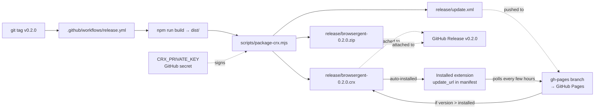

# Release process

How Browsergent is packaged, signed, published, and auto-updated.

## TL;DR for maintainers

1. Bump `version` in `package.json`.
2. `git commit -m "release v0.2.0" && git tag v0.2.0 && git push origin main v0.2.0`.
3. The `Release` workflow builds the `.crx` + `.zip`, attaches them to a GitHub Release, and publishes `update.xml` to the `gh-pages` branch. Chrome picks up the update within a few hours.

The user-facing install/upgrade story lives at the bottom of this doc.

## Architecture



Three moving parts:

1. **`.pem` private key** — pins the extension ID forever. Stored as a GitHub Actions secret named `CRX_PRIVATE_KEY`.
2. **`update.xml`** on `gh-pages` — Chrome's auto-update manifest. Hosted at `https://irvingouj.github.io/Browsergent/update.xml` via GitHub Pages.
3. **`.crx` + `.zip`** attached to each tagged release.

### Why not the Chrome Web Store?

Google will not approve an extension with a top-level runtime-driven JS agent that can act on arbitrary pages. The self-hosted CRX3 + auto-update path is the standard alternative. Users install once via `chrome://extensions`, then updates flow automatically.

## The private key (read this once)

The `.pem` private key determines the extension ID. Once any user installs the extension, **the key cannot change** — changing it produces a different ID, and every user must reinstall.

The key must be a **2048-bit RSA private key in PEM format** — exactly what Chrome's own `chrome.exe --pack-extension` produces, and what `crx3` (the npm package) consumes.

To generate one locally and register it with GitHub:

```bash
# 1. Generate a 2048-bit RSA key in the format crx3/Chrome expects.
openssl genrsa -out browsergent.pem 2048

# 2. Store it as a GitHub Actions secret named CRX_PRIVATE_KEY.
#    The value is the entire file contents including the PEM headers.
#    Do this in the repo settings: Settings → Secrets and variables → Actions → New secret.
gh secret set CRX_PRIVATE_KEY < browsergent.pem

# 3. Store it offline too (1Password, etc). If it's lost, the extension ID changes.
# 4. Delete the local file — it must never be committed.
rm browsergent.pem
```

`.gitignore` already ignores `*.pem`.

### If you lose the key

The extension ID changes. Every installed user must uninstall the old one and install the new one. There is no migration path. This is why the key is stored as a GitHub secret AND backed up offline.

## One-time GitHub Pages setup

The release workflow pushes `update.xml` to the `gh-pages` branch. Enable Pages once:

1. Generate a dedicated deploy key (so the workflow can push without using `GITHUB_TOKEN` rate limits):

   ```bash
   ssh-keygen -t ed25519 -f gh-pages-deploy-key -N "" -C "gh-pages@browsergent"
   # public key  → repo Settings → Deploy keys → Add → Allow write
   # private key → repo Settings → Secrets → New secret named GH_PAGES_DEPLOY_KEY
   ```

2. In repo Settings → Pages:
   - Source: **Deploy from a branch**
   - Branch: **`gh-pages`** / **`/ (root)`**
   - Save.

3. Confirm `https://irvingouj.github.io/Browsergent/update.xml` loads after the first release.

`update.xml` points Chrome at the release's `.crx` URL. If the release is public, Chrome downloads and installs the update without any user action.

## Publishing a release

Bump, tag, push:

```bash
# Bump version in package.json (e.g. 0.1.0 → 0.2.0)
$EDITOR package.json
git commit -am "release v0.2.0"
git tag v0.2.0
git push origin main v0.2.0
```

The workflow:
1. Verifies tag matches `package.json` version (fails if mismatched).
2. Runs typecheck + lint + unit tests.
3. Builds and packages `.crx` + `.zip` + `update.xml`.
4. Creates/updates the GitHub Release with artifacts attached.
5. Pushes `update.xml` to `gh-pages`.

The workflow fails loudly if:
- Tag version ≠ `package.json` version
- `CRX_PRIVATE_KEY` secret is missing
- Typecheck/lint/tests fail
- `GH_PAGES_DEPLOY_KEY` is missing (no auto-update publishing)

## How users install

### First install

Send users to the release page:

```
https://github.com/Irvingouj/Browsergent/releases/latest
```

Two paths:

**Drag-and-drop `.crx` (easiest for most users):**
1. Download `browsergent-<version>.crx` from the latest release.
2. Open `chrome://extensions`.
3. Drag the `.crx` file onto the page. Chrome shows an "Install extension?" dialog.
4. Click **Add**.

Chrome may warn that the extension is not from the Web Store and is from an untrusted source. This is expected for self-distributed extensions.

**Load unpacked `.zip` (Developer mode):**
1. Download and unzip `browsergent-<version>.zip`.
2. Open `chrome://extensions`.
3. Enable **Developer mode** (top-right).
4. Click **Load unpacked**.
5. Select the unzipped folder.

### Updates (automatic)

Once installed, Chrome polls `update.xml` every few hours. When a new version appears:
- Downloaded from the release's `.crx` URL
- Installed automatically on browser restart
- No user action required

### Force a manual update check

`chrome://extensions` → **Update** button (visible in Developer mode).

## Local packaging for testing

```bash
# generate a throwaway key (NOT the production one)
openssl genrsa -out /tmp/dev-key.pem 2048

# build + package into release/
node scripts/package-crx.mjs --key /tmp/dev-key.pem
```

Output lands in `release/`. Use this to test the CRX format before tagging a real release.
. Hosted at the URL in `manifest.json`'s `update_url`.
