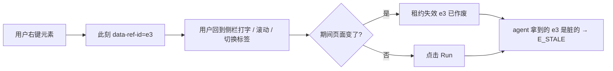
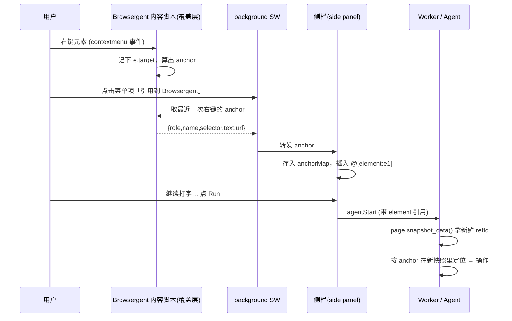

# Browsergent TODO

> **优先级列表已全部完成 (2026-06-21 核查)** — 原列表 5 项（嵌套目录树视图、agent 写后自动刷新、JS tab 脚手架删除、`file_write` E2E、§6 closure E2E）均已落地。剩余工作见下方 §13 / §14 / §15。

## Candidate features (investigated 2026-06-20 — not started)

Four ideas explored for feasibility. Full analysis in §12–§15 below.

| § | Feature | Verdict | Work location |
|---|---------|---------|---------------|
| 12 | Right-click page element → reference it in chat | ✅ Feasible — must capture a **durable locator**, not a raw refId (refIds are lease-bound) | Browsergent content-script overlay + new `@[element:…]` mention |
| 13 | Real file explorer (create/delete/rename/move) | 🔄 In progress (2026-06-21) — runtime supports rename/mkdir/delete; implementing Browsergent panel/controller/slice layer | Browsergent-only (no upstream change) |
| 14 | `@` mention for open tabs | 🔄 In progress (2026-06-21) — extending the `@` mention pipeline | Browsergent-only |
| 15 | Snapshot: full HTML + richer table/list view | ⚠️ Partial — table/list/item **roles already exist**; gaps are flat presentation + no HTML export. ⚠️ **(a) 延后 — 需改 trace 数据模型（`AgentTraceEntry.result` 只存扁平字符串，上游 `SemanticNode` 无 parent/children/depth），属 hardcore（2026-06-21）** | Presentation = Browsergent; HTML export = upstream `web-js` |

Recently shipped:
- **§11 File API ergonomics** — `file_write` tool + unified OPFS root (panel and agent share `/`, no session-scope, no IndexedDB index). web-js 0.8.3 made `fs.*` accept relative paths.
- **§10 `run_js` file reference** — `run_js({ file: { name } })` resolves path through `fileOp` relay.
- **§9 Chat file drop** — drag/drop on input bar uploads + inserts mention.
- **§8 Direct file tools** — `file_list`/`read`/`edit`/`delete` (now path-based).
- **§7 Multi-line input** — Shift+Enter newline, auto-grow textarea.
- **§6 Phase D (user skills)** — drop `SKILL.md` on Files panel → imports under `/skills/`.
- **§3 `@` mentions** — parse → XML attachment block.
- **§6 Layers 1/2a/2b/2c** — `/` palette, activation inject, `load_skill` tool, system catalog.

§4 is folded into §6 Layer 1 (not a separate track).

---

## 1. JS code block UI

**Problem:** Agent `run_js` trace entries render code poorly today.

- `TraceEntryCompact` (`src/sidepanel/components/TraceEntryCompact.tsx`) shows `toolInput` as a plain string.
- Agent `run_js` stores input as truncated JSON (`{"code":"..."}`) from `agent-loop.ts`, so the UI shows escaped JSON instead of readable JS.
- Collapsed preview is `toolInput.slice(0, 60)` — useless for code.
- Running state uses a pulsing `…` badge (`animate-pulse-glow`), not a clear “executing” indicator.

**Goal:** JS runs should look like code blocks, with an obvious in-flight state.

### UI behavior

- [x] **Extract code** from trace input:
  - `toolName === "run_js"` → parse JSON, read `code` string.
  - Fallback: show raw `toolInput` if parse fails.
- [x] **Code block rendering** (replace plain `<div>` text):
  - Monospace block with padding, border, dark surface (`bg-bg-surface`).
  - `white-space: pre-wrap` + `overflow-x: auto` for long lines.
  - Optional: light syntax highlighting — keep dependency-free if possible.
- [x] **Running indicator** when `entry.status === "running"`:
  - Small **spinner** next to the tool name (CSS `@keyframes spin`).
  - Keep existing success ✓ / error ✗ badges for terminal states.
- [x] **Collapsed header** for `run_js`:
  - Preview first meaningful line of code (skip leading comments/blanks), not JSON.
- [x] **Result section:** `font-mono` for console output.

### Files likely touched

- `src/sidepanel/components/TraceEntryCompact.tsx`
- `src/sidepanel/styles.css`
- Optional: `src/sidepanel/components/parse-trace-code.ts`

### Acceptance criteria

1. Expanding a `run_js` step shows formatted JS, not `{"code":...}` JSON.
2. While JS is executing, user sees a spinner beside the step without expanding.
3. No regression for non-JS tools (`get_doc`, etc.).

---

## 2. Remove JS tab → Files panel (file tree + preview + upload)

**Problem:** The **JS** tab (`JsPlaybookPanel`, header toggle in `app.tsx`) is unused. Secondary manual JS runner duplicates what the agent already does via `run_js`.

**Goal:** Replace the JS tab with a **Files** side-panel view. The primary view is a **file tree**; upload is a feature within it, not the main purpose.

### Remove

- [ ] Header **JS** tab button and `activeTab === "js"` branch in `app.tsx`.
- [ ] `JsPlaybookPanel.tsx` (or repurpose file into Files panel).
- [ ] `UiTab` `"js"`, `jsCodeDraft`, `setJsCodeDraft`, `selectJsCodeDraft` from `ui-slice.ts` / selectors.
- [ ] Playbook-only UX: standalone Run/Stop in playbook (agent `run_js` relay via `ExtensionJsClient` **stays**).
- [ ] `tests/js-playbook-fill-form.spec.ts` — delete or rewrite as files-panel test if needed.
- [ ] Worker messages used only by playbook UI (`extjsRun` from panel, not agent relay) — audit `worker/index.ts` and remove dead paths.

### Add — Files panel

- [ ] New tab: **Files** (or icon-only) replacing JS in header toggle.
- [ ] **File tree** (primary, left pane): folders + files, expand/collapse, select to preview.
- [ ] **Preview** (right pane): text/markdown for `.md`, `.txt`, `.json`, etc.; binary shows name + size only.
- [ ] **Upload**: button in tree header + drag-and-drop onto tree area; multi-file supported.
- [ ] **Storage** (pick one, document in code):
  - Session-scoped virtual FS in IndexedDB, and/or
  - `extension-js` `fs.*` if suitable for extension context, and/or
  - `chrome.storage` for small metadata + blob store for content.
- [ ] Persist file list per session (save/load with `session-controller`).

### Layout sketch

```text
┌─────────────────────────────────────┐
│ Chat │ Files          [⋯]          │
├─────────────────────────────────────┤
│  Files tree     │  Preview          │
│  ├─ notes.md    │  # Hello          │
│  └─ data.json   │  ...              │
│  [+ Upload]     │                   │
└─────────────────────────────────────┘
```

The **Files tree** is the main view; **Upload** is an action within it, not a separate tab. Treat it like a file manager (tree first, upload as a toolbar action).

### Files likely touched

- `src/sidepanel/app.tsx` — tab switch, remove `JsPlaybookPanel`
- `src/sidepanel/components/FilesPanel.tsx` (new)
- `src/state/slices/ui-slice.ts` — `UiTab: "chat" | "files"`
- `src/state/slices/files-slice.ts` (new) — tree nodes, selected file, blob refs
- `src/controllers/session-controller.ts` — optional files payload in session snapshot

### Acceptance criteria

1. No JS tab in UI; no regression to agent chat or `run_js`.
2. User can upload a file, see it in the tree, and preview its contents.
3. Files survive session switch if session persistence is enabled for that session.

---

## 3. `@` command — reference files in the task input

**Problem:** User cannot attach context from the Files panel when typing a task.

**Goal:** Typing `@` in the task input opens a picker; selecting a file inserts a stable reference the agent can use.

### UI behavior

- [ ] On `@` in `InputBar`, show anchored **file picker** (fuzzy filter as user continues typing).
- [ ] Picker lists files from the current session’s file tree (§2).
- [ ] On select, insert a token into the draft, e.g. `@notes.md` or `@[file:abc123:notes.md]` (exact format TBD — must be parseable and unambiguous).
- [ ] Keyboard: ↑↓ navigate, Enter select, Esc dismiss.
- [ ] Render tokens as chips or highlighted spans in the input (or keep plain text with distinct syntax).

### Agent / prompt plumbing

- [ ] On **Run**, resolve `@` references to file contents (or summaries for large files).
- [ ] Inject into the user message or a structured attachment block the worker sends to the model (keep typed boundaries — no raw string soup).
- [ ] Cap size / truncate with explicit “[truncated]” marker; surface in trace.
- [ ] Agent prompt: explain that `@filename` means “user attached this file; use its contents as context.”

### Files likely touched

- `src/sidepanel/components/InputBar.tsx` — `@` detection, picker UI
- `src/sidepanel/components/FileMentionPicker.tsx` (new)
- `src/sidepanel/resolve-file-mentions.ts` (new) — parse draft → attachments
- `src/worker/agent-loop.ts` or message assembly — attach resolved content
- `src/worker/js-tool-prompt.ts` — document `@` semantics for the model

### Acceptance criteria

1. Type `@` → see files → pick one → token appears in input.
2. Run task with `@notes.md` → model receives file content (visible in diagnostics/export).
3. Broken reference (`@missing.txt`) → clear error before or at run start, not silent failure.

---

## 4. (merged into §6 Layer 1)

`/ command palette` is **not** a separate feature. See **§6 → Layer 1 — Compose-time (mandatory)**.

---

## 5. Refocus input bar when agent becomes idle

**Problem:** After a run finishes (`done`, `stopped`, `error`, or `idle`), focus often stays on the page, trace, or stop button.

**Goal:** When the agent leaves a running state, focus returns to the task input.

### UI behavior

- [x] Watch transition: `loading` / `running` / `waiting_for_model` / `executing_tool` → terminal (`idle`, `done`, `stopped`, `error`).
- [x] On transition, `inputRef.focus()` in `InputBar`.
- [x] Do not steal focus if settings/session panel is open or focus is intentionally inside another side-panel control.

### Files likely touched

- `src/sidepanel/components/InputBar.tsx`
- `data-testid="task-input"` for E2E

### Acceptance criteria

1. Run completes → task input focused without clicking.
2. Mid-run → input not repeatedly refocused.
3. Stop → input enabled and focused.

---

## 6. Agent Skills system (highest priority)

**Research summary (2026):** [Agent Skills](https://cursor.com/docs/skills) is an **open standard** ([agentskills.io](https://agentskills.io/specification)) adopted by Cursor, Claude Code, Codex, VS Code Copilot, and others. One format, many hosts.

### Mandatory: two layers (both required)

Skills are **not** one feature. Browsergent must implement **two distinct layers**, like Cursor does when you type `/create-skill` vs when the agent runs:

```text
┌──────────────────────────────────────────────────────────────────┐
│ LAYER 1 — Compose-time (user typing, agent NOT running)          │
│   SkillRegistry metadata · `/` palette · fuzzy match             │
│   Agent sees: nothing until user hits Run                        │
│   Cursor analogue: `/` picker + skill name/description index       │
└──────────────────────────────────────────────────────────────────┘
                              │ Run (+ optional activated skills[])
                              ▼
┌──────────────────────────────────────────────────────────────────┐
│ LAYER 2 — Runtime (agent loop active) — TWO mechanisms, BOTH req │
│                                                                  │
│  2a. Activation inject — user picked `/skill` at compose time    │
│      → skill body prepended to user task (or first user message)  │
│      Cursor analogue: manually_attached_skills inlined in request│
│                                                                  │
│  2b. get_skill tool — agent calls during the run                 │
│      → tool_result returns SKILL.md body or references/* path    │
│      Cursor analogue: progressive load / agent pulls skill text  │
└──────────────────────────────────────────────────────────────────┘
```

| Layer | When | Who consumes | Mandatory? |
|-------|------|--------------|------------|
| **1 — Compose** | User types `/cre…` in InputBar | Side panel UI only | **Yes** |
| **2a — Inject** | User clicks Run with activated skill(s) | Model (in user task) | **Yes** |
| **2b — `get_skill`** | Agent tool call mid-run | Model (in `tool_result`) | **Yes** |

Do **not** ship skills with only Layer 1 (palette that does nothing on Run) or only Layer 2b (tool with no `/` UX). Do **not** conflate them: typing `/` is not a tool call.

**Shared foundation:** `SkillRegistry` (parse `SKILL.md`, validate frontmatter, `listSkills()`, `loadSkillBody()`, `loadSkillResource()`).

---

### Layer 1 — Compose-time (mandatory)

**Problem:** User cannot discover or invoke skills while drafting a task.

**Goal:** `/` in the task input opens a palette backed by `SkillRegistry` metadata only (`name`, `description`). No worker, no model call.

- [x] `SkillRegistry` at sidepanel init: OPFS under `/skills/bundled/**` (seeded from `public/skills/bundled/`); user skills deferred to §6 Phase D.
- [x] `listSkills(): SkillMeta[]` — `name`, `description`, `disableModelInvocation`, paths for UI badges.
- [x] **`/` palette** (`CommandPicker` in `InputBar.tsx`): fuzzy filter on name/description; shared picker primitive ready for `@` (§3).
- [x] On skill select: insert token `/skill:{name} ` (parseable at Run via `parseSkillActivation`).
- [ ] Track **activated skills** for this draft separately from free text (e.g. `ui.activatedSkillIds: string[]`) — **deferred v1**: single `/skill:name` token in draft is sufficient.
- [x] While typing `/`: **agent is not involved** — pure Preact UI.
- [ ] Optional builtins: thin aliases mapping to a skill id (same registry) — not needed for v1.

**Files:** `InputBar.tsx`, `CommandPicker.tsx`, `skill-registry.ts`, `parse-skill-md.ts`, `skill-service.ts`

**Acceptance:**

1. Type `/` → palette lists skills with descriptions (metadata only).
2. Select skill → visible in input; agent not started.
3. `@` and `/` pickers do not conflict.

---

### Layer 2a — Activation inject (mandatory)

**Problem:** User picked a skill in Layer 1 but agent never receives the full `SKILL.md` body.

**Goal:** On **Run**, resolve activated skills and inject instructions **before** the agent loop’s first model call.

- [x] `parseSkillActivation(draft)` → `SkillActivation` from `/skill:{name}` token (single skill v1).
- [x] `buildResolvedTask` / `resolveTaskWithSkill` — XML `<skill>` block + optional `User task:` remainder.

- [x] Pass `resolvedTask` on `agentStart`; original `task` kept for display/export.
- [x] `disable-model-invocation: true` skills: inject **only** if user activated via `/skill:`; excluded from catalog; `load_skill` gated by `activatedSkills` whitelist.
- [x] Size cap + truncate with `[skill truncated]` marker on inject (tool results already capped in `agent-tools.ts`).

**Files:** `resolve-skill-activations.ts`, `app.tsx` `handleRun`, `worker/index.ts` / `agentStart` payload

**Acceptance:**

1. `/capability-check` + Run → first turn includes full skill body (not just the slash label).
2. Run without `/` → no skill body injected (unless Layer 2c auto applies later).

---

### Layer 2b — `load_skill` tool (mandatory; spec name was `get_skill`)

**Problem:** Agent needs skill text **during** a run (progressive disclosure, references/, skills not activated at compose time).

**Goal:** Mirror `get_doc`: agent calls a tool; receives markdown in **`tool_result`**.

- [x] Add `load_skill` to `createAgentTools()` in `agent-tools.ts` (relay to sidepanel `SkillService.loadSkill`).

  ```typescript
  load_skill({
    skill: string;           // required, e.g. "capability-check"
    path?: string;           // optional, e.g. "references/checklist.md"
  }): string                // markdown, size-capped
  ```

- [x] No `path` → `SkillRegistry.loadSkillBody(skill)`.
- [x] With `path` → `SkillRegistry.loadSkillResource(skill, path)` under skill root only (no `..`).
- [x] Unknown skill / path → structured tool error with `hint` + `recovery` (same pattern as `get_doc` failures).
- [x] Register in `anthropic-prompts.ts` tool list + describe in `composeSystemPrompt`.
- [x] Trace shows `load_skill` like `get_doc` (tool name + truncated result).

**No SDK changes** — same pattern as `get_doc`; worker + sidepanel registry only. **Locked:** keep tool name `load_skill` (do not rename to `get_skill`).

**Acceptance:**

1. Agent can `get_skill({ skill: "capability-check" })` and receive full body in tool result.
2. `get_skill({ skill: "x", path: "references/foo.md" })` returns file content.
3. Works on a run **without** Layer 2a inject (tool-only path).

---

### Layer 2c — System metadata catalog (mandatory for 2b to be useful)

- [x] Inject `<available_skills>` XML catalog via `formatSkillCatalog` on every run (`composeSystemPrompt`).

- [x] Metadata only — not full `SKILL.md` bodies (those come from 2a inject or 2b tool).
- [x] Respect `disable-model-invocation: true`: excluded from catalog; `load_skill` blocked unless user activated at compose time

---

### How skills work elsewhere (reference)

| Layer | What loads | When |
|-------|------------|------|
| **Metadata** | `name`, `description` from YAML frontmatter (~100 tokens/skill) | Host startup — agent sees catalog |
| **Instructions** | Full `SKILL.md` markdown body | When skill is **activated** (auto or `/name`) |
| **Resources** | `scripts/`, `references/`, `assets/` | **Progressive disclosure** — only when skill text tells agent to read them |

**Discovery paths (Cursor):** `.agents/skills/`, `.cursor/skills/`, `~/.agents/skills/`, `~/.cursor/skills/` (recursive `**/SKILL.md`).

**Invocation modes:**

- **Auto** — host puts skill metadata in context; model decides relevance from `description`.
- **Manual** — user types `/skill-name` in chat; or frontmatter `disable-model-invocation: true` (slash-only).

**Standard folder layout:**

```text
capability-check/
├── SKILL.md          # required: frontmatter + instructions
├── references/       # optional: loaded on demand
├── scripts/          # optional: executables (host-specific)
└── assets/           # optional: templates, data
```

**`SKILL.md` frontmatter (required fields):**

```yaml
---
name: capability-check        # must match directory name
description: Runs a structured page capability probe via run_js. Use when testing Browsergent on the current tab or when the user asks for a capability check.
disable-model-invocation: true   # recommended for Browsergent v1: explicit / only
compatibility: Browsergent Chrome extension; requires run_js and get_doc.
metadata:
  version: "1.0"
---
```

Body = step-by-step workflow (your long capability-check prompt belongs here as a skill, not hardcoded in chat).

### Can Browsergent add this?

**Yes.** Skills map cleanly to Browsergent:

| Standard concept | Browsergent mapping |
|------------------|---------------------|
| Skill instructions | Injected into **system prompt** and/or first **user message** for the run |
| `scripts/` | Not shell — **`run_js` snippets** in `scripts/*.js` or markdown code blocks the agent copies |
| `references/` | Resolved via **`@file`** (§3) or new tool **`get_skill_ref`** |
| Auto-discovery | Append skill **metadata list** to `SYSTEM_PROMPT` in `anthropic-prompts.ts` |
| `/skill-name` | §4 palette → `SkillRegistry.activate(name)` |
| Progressive disclosure | New agent tool **`get_skill`** (mirror `get_doc`): `{ skill, section? }` returns body or `references/foo.md` |

**Constraints (be explicit in skill docs):**

- Agent’s only browser tool is **`run_js`** (+ **`get_doc`**, + future **`get_skill`**).
- Skills must not assume `bash`, repo file access, or Cursor MCP — unless `compatibility` says otherwise.
- `allowed-tools` (experimental in spec) could map to `run_js`, `get_doc`, `get_skill` only.

### Why agents will understand good errors + skills

Modern models **do** follow structured workflows when the skill body is in context. They fail when:

- Only a vague slash label is inserted without the full `SKILL.md` body.
- Skill says “use page.fill” but `get_doc` wasn’t called (skill should say: call `get_doc` first).

Skills are **procedural prompts with optional attachments** — a good fit for Browsergent.

### Implementation order (within §6)

1. [x] `SkillRegistry` + bundled `public/skills/bundled/**` + unit validation (`tests/unit/skill-*.spec.ts`)
2. [x] **Layer 1** — `/` palette
3. [x] **Layer 2a** — inject on Run
4. [x] **Layer 2b** + **2c** — `load_skill` tool + system metadata catalog
5. [x] Ship first-party skills:
   - `capability-check/` — developer probe prompt
   - `fill-and-submit/` — golden-path form workflow
   - `create-skill/` — skill authoring for Browsergent
6. [ ] **Closure:** inject size cap, Playwright E2E for compose → inject → `load_skill` mid-run

#### Phase D — User skills (optional, ties to §2 Files)

- [ ] Import skills from Files panel: user drops `my-skill/SKILL.md` under `skills/` in session FS.
- [ ] Merge with bundled registry (user overrides win on name collision).
- [ ] Export/import skill folders in conversation export (optional).

### Browsergent-specific skill authoring guide

Write skills for **browser agent**, not IDE agent:

```markdown
## Instructions
1. Call get_doc({ namespace: "page" }) if unsure of API shapes.
2. Use page.snapshot() for overview; page.snapshot_data() before fill/click.
3. Use page.fill({ refId, value }) object form only.
4. One probe per run_js cell; log results with console.log.
5. If E_CONTENT_SCRIPT: follow recovery in error (page.goto current URL).

## Scripts
- scripts/probe-metadata.js — copy into run_js for step 1
```

### Files (implemented)

```text
public/skills/bundled/
  capability-check/SKILL.md
  fill-and-submit/SKILL.md
  create-skill/SKILL.md
src/skills/
  parse-skill-md.ts, skill-registry.ts, skill-types.ts, skill-service.ts
  resolve-skill-activations.ts, format-skill-catalog.ts, seed-bundled-skills.ts
src/worker/agent-tools.ts   # load_skill relay
src/sidepanel/components/CommandPicker.tsx, InputBar.tsx
tests/unit/skill-*.spec.ts, tests/unit/input-bar.spec.tsx, ...
tests/skill-compose-inject.spec.ts   # TODO (E2E closure)
```

### Acceptance criteria (all mandatory layers)

**Layer 1**

1. `/` shows skill list from metadata; selecting does not start agent.

**Layer 2a**

2. `/capability-check` + Run → task includes full skill body; matches `browsergent-conversation-*.json` probe behavior.
3. `disable-model-invocation: true` → no inject unless user activated via `/`.

**Layer 2b + 2c**

4. [x] `load_skill({ skill })` returns body in tool_result without prior inject (unit tests).
5. [x] `load_skill({ skill, path })` returns `references/*` content (unit tests).
6. [x] System prompt lists skill metadata only; bodies not duplicated at startup.

**Shared**

7. [x] Invalid `SKILL.md` surfaces as `SkillDiagnostic` at init; unit tests in `validate-skill-meta.spec.ts`.
8. [x] End-to-end: compose `/skill:` → inject on Run **and** agent can `load_skill` for another skill mid-run (Playwright).

### Baseline correctness (pi parity, 2026-06-09)

- [x] Enforce `disable-model-invocation` on `load_skill` via per-run `activatedSkills` whitelist
- [x] Standards-compliant YAML frontmatter (`yaml` package; arrays, multiline, comments)
- [x] Skill name/description validation per agentskills.io; XML-safe skill injection
- [x] OPFS seed cleanup removes retired bundled files on manifest version change
- [x] Validation and collision diagnostics (`SkillDiagnostic`; `console.debug` on init)
- [x] Picker refresh via `SkillService.refresh()` / `subscribeSkillsChanged()` + input focus
- [x] Manifest SHA-256 verification before writing seeded bundled files

### References

- [Cursor Agent Skills docs](https://cursor.com/docs/skills)
- [agentskills.io specification](https://agentskills.io/specification)
- Browsergent probe prompt → candidate content for `public/skills/capability-check/SKILL.md`

---

## 7. Multi-line input (Shift+Enter for newline)

**Problem:** Currently `Enter` sends the task immediately. There is no way to write multi-line tasks (e.g., pasted code, step-by-step instructions, multi-paragraph prompts) without the agent starting prematurely.

**Goal:** `Enter` sends, `Shift+Enter` inserts a newline. The input should grow to fit content (auto-resize textarea).

### UI behavior

- [x] Replace `<input>` with `<textarea>` in `InputBar.tsx` (required for multi-line)
- [x] `Enter` (without modifiers) → send (call `onRun`)
- [x] `Shift+Enter` → insert newline, do not send
- [x] Auto-resize: textarea height grows with content up to a max (e.g., 40vh), then scrolls
- [x] Reset height to single-line when draft is cleared (after send)
- [x] Picker (`@` / `/`) still works: anchored to cursor position in textarea

### Plumbing

- [x] Update `inputRef` type from `HTMLInputElement` to `HTMLTextAreaElement`
- [x] Update `onKeyDown` handler: check `e.shiftKey` before triggering send on Enter
- [x] Update `refreshPickerState` and `applyPickerSelection` to work with textarea selection API
- [x] CSS: `resize: none`, `min-h` / `max-h` for auto-grow, `overflow-y: auto` when tall

### Acceptance criteria

1. `Enter` sends the task (same as today).
2. `Shift+Enter` inserts a visible newline; task is not sent.
3. Textarea grows with content and does not push the chat area off-screen.
4. After send, textarea resets to single-line height.
5. `@` and `/` pickers still open and insert correctly in multi-line content.
6. Cursor position and selection still work after picker insertion.

**Problem:** The agent can only interact with uploaded files by reading their content through `@[file:...]` mention injection at compose time. During a run, the agent has no way to read, edit, delete, or list files — it would need to emit `run_js` code that calls OPFS APIs, which is fragile and indirect.

**Goal:** Expose native agent tools for file operations, similar to how `load_skill` exposes skill resources.

### Tools

- [x] `file_read({ path })` — read file content from OPFS session store; text only; size-capped
- [x] `file_edit({ path, patch })` — apply a text patch (diff or full replacement) to an existing file
- [x] `file_delete({ path })` — remove a file from the session's OPFS store and index
- [x] `file_list({ prefix? })` — list files in the current session's store; optional prefix filter

### Plumbing

- [x] Route tool calls through `agent-tools.ts` → worker relay → sidepanel `FilesController` (same pattern as `load_skill`)
- [x] `FilesController` already has `readFileText`, `deleteFile`, `listSessionFiles` — expose via tool interface
- [x] Add `editFile` method to `FilesController` (read → apply patch → write → update index)
- [x] Add tool descriptions to `js-tool-prompt.ts` or `anthropic-prompts.ts`
- [x] Trace entries for file tools (same as `run_js` / `load_skill`)

### Acceptance criteria

1. Agent can `file_list()` and see session files during a run.
2. Agent can `file_read({ path: "notes.md" })` and receive file content.
3. Agent can `file_edit({ path: "notes.md", patch: "..." })` and the file is updated in OPFS + index.
4. Agent can `file_delete({ path: "notes.md" })` and the file is removed.
5. Tools only access files within the current session's OPFS scope (path traversal blocked).

---

## 8. Chat input file drop → upload + auto-attach

**Problem:** Users must switch to the Files tab, upload a file, switch back to Chat, and type `@[file:...]`. This is cumbersome for the common case of "attach this file and do something with it."

**Goal:** Drag-and-drop (or paste) a file directly onto the chat input bar → upload to OPFS → auto-insert `@[file:...]` token into the draft.

### UI behavior

- [x] Detect `drop` / `paste` events on the task input or input bar area
- [x] On file drop: upload to OPFS via `FilesController.uploadFiles`, add to store
- [x] After upload, insert `@[file:id:filename]` token into the task draft at cursor position
- [x] Show a brief upload indicator (spinner or progress) while uploading
- [x] Support multiple files: one token per file, inserted sequentially

### Plumbing

- [x] `InputBar.tsx` — `onDrop` / `onPaste` handlers that call `FilesController.uploadFiles`
- [x] Need access to `FilesController` in `InputBar` (via props or store)
- [x] Need access to `sessionId` in `InputBar` (from store)
- [x] `onFilesChanged` callback to flush session save after upload

### Acceptance criteria

1. Drop a `.txt` file onto the input → file uploads, `@[file:...]` token appears in draft.
2. Drop multiple files → all uploaded, all tokens inserted.
3. Run with the token → agent receives file content as attachment.
4. Drop a binary file → token inserted, but mention resolution shows "File is not text" error.
5. Paste an image → handled gracefully (upload as binary or reject with message).

---

## 9. `run_js` with file reference

**Problem:** The agent's only tool is `run_js`, which takes inline JS code. If a user uploads a script file (`.js`) via the Files panel or drops it on the input, the agent cannot execute it directly — it would need to read the file content and embed it in a `run_js` call.

**Goal:** Allow `run_js` to accept a file reference, so the agent can execute an uploaded script without manually reading and inlining its content.

### Tool enhancement

- [ ] Extend `run_js` tool input schema with optional `file?: { id: string }` parameter
- [ ] When `file` is provided: read file content from OPFS → prepend/replace as the code to execute
- [ ] When both `code` and `file` are provided: `file` content runs first, then `code` (or `code` overrides — TBD)
- [ ] Update `js-tool-prompt.ts` to document the `file` parameter

### Plumbing

- [ ] `agent-tools.ts` — resolve file reference before sending to `relayExtjsExecution`
- [ ] `FilesController.readFileText(sessionId, fileId)` — already exists
- [ ] Need session ID and files controller access in the worker relay path
- [ ] Trace entry shows file reference + execution result

### Acceptance criteria

1. Agent calls `run_js({ file: { id: "abc" } })` → file content is loaded from OPFS and executed.
2. Agent calls `run_js({ code: "...", file: { id: "abc" } })` → both are available (exact semantics TBD).
3. File not found or not text → structured tool error with hint.
4. File content is still subject to the same size/cap limits as inline code.

---

## 10. File API ergonomics for LLM (DONE 2026-06-13)

**Status:** Shipped. Two layers:

1. **web-js 0.8.3** — `path_parts` accepts relative paths (resolved against root `/`), `FsError::InvalidPath` carries context, `fs.*` docs explain path rules. `fs.writeText("foo.md", ...)` works in one call.
2. **Browsergent unified FS refactor** — added `file_write({ path, content })` tool; dropped `/session-files/{sid}/` namespace, `.index.json` side index, IndexedDB `filesIndex`, `{uuid}-{name}` IDs. Panel + agent share OPFS root `/`. See §11 below.

Original problem statement (preserved for context):

**Problem:** Agent took **13 steps** to create a simple file (`fs struggle.json` trace). Root causes:

1. **No `file_write` / `file_create` tool** — agent has `file_list/read/edit/delete` but can only *edit existing* files. To create a new file it fell back to the low-level `fs.*` API.
2. **`file_edit` rejects new files** — returns `E_FILE_NOT_FOUND` when the file doesn't exist (no upsert).
3. **`fs.*` path rules are undocumented** — requires absolute paths (`/tmp/foo.md`), but `get_doc` just says `path: File path`. Agent wasted 6+ steps discovering this via trial-and-error `E_INVALID_PATH`.
4. **`/tmp/` writes are invisible** — agent eventually wrote to `/tmp/reddit_feed_today.md`, but Files panel only shows `/session-files/{sessionId}/`. User couldn't find the file.

**Goal:** The agent should create a session file in **1 step**, and the file should appear in the Files panel immediately.

### Design — intent-based tools (no paths needed)

- [ ] **Add `file_write(name, content)` tool** — creates or overwrites a session file. Full-content write, no `old_string` matching. This is the "I want to save this" intent.
- [ ] **Keep `file_edit(name, old_string, new_string)` as-is** — for precise in-place edits where the agent must match existing content. Not for creation.
- [ ] Both write to `/session-files/{sessionId}/` → auto-appear in Files panel → user can preview/download.

### Design — `fs.*` low-level API guidance

- [ ] **Add path convention to `js-tool-prompt.ts`**:
  ```
`
  ## Filesystem paths (fs.*)
  - All paths must be absolute (start with `/`).
  - `/session-files/{sessionId}/` — session files (visible in Files panel). Prefer file_write/file_edit tools instead.
  - `/tmp/` — scratch space (not visible to user, cleared on session end).
  - `/skills/user/{name}/` — user-imported skills.
  - Bare filenames like `foo.md` are invalid — always use `/tmp/foo.md` or a full path.
  ```
  ```
- [ ] **Improve `E_INVALID_PATH` recovery hint** in agent error formatting — suggest `"Paths must be absolute. Example: /tmp/foo.md"`.
- [ ] (Upstream, optional) Enrich `get_doc` output for `fs` namespace with path examples.

### Implementation notes

- `file_write` handler in `agent-tools.ts`: takes `{ name: string, content: string }`, calls `fileOp` relay with a new `write` op (or reuse `edit` with empty `old_string`).
- `FileOpRelay` (`file-op-relay.ts`) may need a new `write` op, OR `file_edit` semantics change to: empty `old_string` + file-not-exists → create.
- Size cap: same as inline code (`MAX_FILE_BYTES` from `files-utils.ts` or similar).
- Session file index (`/session-files/{sessionId}/.index.json`) must be updated so the file appears in the panel.

### Acceptance criteria

1. Agent says "create a file with this content" → calls `file_write` → file appears in Files panel in 1 step.
2. `file_write` to an existing name → overwrites cleanly (no duplicate).
3. `file_edit` on a non-existent file without empty `old_string` → still returns `E_FILE_NOT_FOUND` (edit is still strict-match).
4. `fs.writeText('foo.md', ...)` (bare filename) → error message says "use absolute path like /tmp/foo.md".
5. Files written via `file_write` are immediately visible in the Files panel without manual refresh.

---

## 11. Unified OPFS filesystem (DONE 2026-06-13)

**Principle:** "We only have one file system, and everything is exposed to user and LLM, just like you can access everything on my computer. We don't add crappy abstractions on top of anything."

**What was removed:**

| Abstraction | Disposition |
|---|---|
| `/session-files/{sessionId}/` namespace | Dropped — files live at OPFS root `/` |
| `.index.json` side-index file | Dropped — panel scans OPFS directly |
| IndexedDB `filesIndex: FileNode[]` in session records | Dropped — OPFS is the source of truth |
| `{uuid}-{name}` file IDs | Dropped — path IS the ID |
| `validateFileToolPath` "no leading `/`" rule | Dropped — absolute paths allowed |
| `findFileEntry` name→id lookup | Dropped — handler operates by path |
| `syncIndexFromSnapshot` / `hydrateAndSyncFiles` / `cleanupSession` | Dropped — files are global to extension |

**New surface:**

- `FilesController.uploadFiles(files)` / `listAllFiles()` / `readFileText(path)` / `writeFile(path, content)` / `deleteFile(path)` / `editFile(path, ...)`
- `file_write({ path, content })` tool — added alongside `file_list/read/edit/delete`
- `FileOp`/`FileOpResult` unions gained `write` variant
- `js-tool-prompt.ts` documents shared-FS semantics

**Follow-ups (see Priority list):** nested-dir tree view in panel, auto-refresh on agent writes, E2E for `file_write`.

---

## 12. 右键页面元素 → 在聊天中引用（context-menu）

**问题：** 用户无法把 agent「指向」页面上的某个具体元素（「*这个*按钮」「*那一行*」），只能用自然语言描述。目标：在活动标签页上右键一个元素，把它的引用插入到聊天输入框，并能在现有的 snapshot 系统里被 agent 使用。

### 可行性结论：✅ 可行 —— 但**不能直接抓 refId**，必须抓「持久锚点」

这是整个设计里最关键的一点，下面展开说明为什么。

#### 为什么不能直接把右键时的 refId 塞进聊天？

调查发现（源码在 `../web-js`）：

- refId 的解析靠 `document.querySelector('[data-ref-id="eN"]')`（`crates/extension-js/js/dist/content-script/dom-utils.js`）。
- 而 `data-ref-id` 这个属性**只在 `page.snapshot_data()` 执行时**才会被采集器盖到元素上（`crates/dom-semantic-tree/src/collect.rs:438`，`element.set_attribute("data-ref-id", &ref_id)`）。
- **更要命的约束 —— observation lease（观察租约）：** refId 不是「永久指向某个元素」的 ID，而是一张「短期许可证」。采集之后，只要发生**任何 DOM 结构变化**（点击、跳转、SPA 重渲染、甚至下拉框展开），租约就作废（`content-script/observation-lease.js`，会抛 `E_STALE: disconnected | fingerprint_changed`）。这在 `js-tool-prompt.ts` 第 16–18 行对 agent 也是强调过的铁律。

把这条约束放到真实使用场景里看：



也就是说：用户右键之后，几乎一定会先打字、再点 Run；只要中间页面有任何动静（SPA 很常见），那个 refId 就是脏的。所以「直接捕获 refId」作为引用载体 **不可行**。

#### 目标设计：抓「持久锚点」，让 agent 在 Run 时自己重新解析

右键时，不存 refId，而是存一组**能跨 DOM 变化存活、可被语义匹配**的锚点；agent 在 Run 时先做一次新的 `page.snapshot_data()`，再用这组锚点在新快照里找到对应元素，拿到**新鲜的、合法的** refId 再操作。

### 锚点（anchor）长什么样、怎么算

按稳定性从高到低，组合使用（参考 `dom-utils.js` 里已有的 `findElementByLabel` / `findSemanticCandidates`）：

| 字段 | 来源 | 为什么稳 |
|---|---|---|
| `role` | `infer_role()`（`role.rs`） | 语义角色，结构变了也不变（按钮还是按钮） |
| `name` | 可访问名（`aria-label` / `label[for]` / 文本，见 `name.rs`） | 人类可读、最不容易重复 |
| `tag` | 元素标签名 | 兜底 |
| `text` | 裁剪后的文本片段 | 二次校验 |
| `selector` | 短 CSS 选择器（如 `nav button.primary`） | role+name 歧义时的兜底定位 |

**刻意不选 XPath**：XPath 对结构变化极敏感（任何一层 div 增减都会断），违背「持久」初衷。优先 `role + name`，selector 仅作 fallback。

解析侧（agent）逻辑：新快照的 `nodes` 里，先按 `role + name` 唯一匹配 → 命中就用它的 `refId`；若歧义（多个匹配），用 `selector`/`text` 收窄；仍找不到 → 返回结构化错误，提示用户「元素已不在页面上」。

### 端到端数据流



### contextMenus API 的一个坑（决定了为什么要两步）

`chrome.contextMenus.onClicked` 回调给你的是 `info` + `tab`，**但不包含被右键的那个 DOM 元素**。所以不能在 background 里直接拿到目标。必须：

1. 内容脚本侧注册 `contextmenu` 监听器，在用户右键的**那一刻**就把 `e.target` + 算好的 anchor 缓存住；
2. 用户点菜单项时，`onClicked` 给内容脚本发消息，内容脚本把**刚才缓存的** anchor 回传。

（替代方案：完全不用 `chrome.contextMenus`，在内容脚本里自己画一个自定义右键菜单。控制力更强但等于重造轮子；**推荐用原生 `chrome.contextMenus`**，原生体验、代码更少。）

### 实现拆解

#### 1. 内容脚本覆盖层（不动上游）

- [ ] **单独注册一个 Browsergent 自己的内容脚本**（`public/manifest.json` 里加第二个 `content_scripts` 条目，或运行时用 `chrome.scripting.registerContentScripts`），监听 `contextmenu`、缓存 `e.target`、算 anchor。**绝不修改**上游 `extension-js` 的 `content-script.js`。
- [ ] 匹配范围 `http://*/*`、`https://*/*`（和上游一致）；**排除** `chrome-extension://`、`chrome://`（守 AGENTS.md 的测试不变式 —— 侧栏永远不是操作目标）。
- [ ] iframe：初版可只管顶层（`all_frames: false`，和现状一致）；后续若要支持 iframe 内元素再开 `all_frames`。
- [ ] shadow DOM：open 的能到，closed 的够不到 —— 文档里写明这个限制即可。

#### 2. background 接线（`src/background/index.ts`）

- [ ] `chrome.runtime.onInstalled` 里 `chrome.contextMenus.create({ id, title: "引用到 Browsergent", contexts: ["all"] })`（或收窄 `contexts` 到可交互元素）。
- [ ] `chrome.contextMenus.onClicked` → 向活动标签页内容脚本发消息取 anchor → 转发给侧栏。

#### 3. 新引用类型 `@[element:…]`

- [ ] token 只装一个短 id（如 `@[element:e1]`），真正的 anchor 存在侧栏的 `anchorMap`（`id → {role,name,tag,selector,text,url,capturedAt}`）。这和 `@[file:id:name]` 只装 id、内容延迟解析是同一个思路，保持草稿文本干净。
- [ ] 在 `detect-mention-state.ts` 里识别该 token（可考虑渲染成 chip）。

#### 4. Run 时解析（新 `resolve-element-mentions.ts`）

- [ ] 把 anchor 转成 XML 注入任务上下文，**不在这一步产生 refId**：
  ```xml
  <element_reference role="button" name="Sign in" tag="button"
                     selector="header button[data-test='signin']"
                     text="Sign in" capturedUrl="https://app.example.com/home"/>
  ```
- [ ] anchor 缺失（比如页面关了）→ 明确报错，不静默失败。

#### 5. Agent 提示词（`js-tool-prompt.ts`）

- [ ] 告诉模型：`@[element:…]` = 「用户指着这个元素；请先 `page.snapshot_data()`，按 role+name（必要时用 selector）在新快照里定位，拿到**新鲜 refId** 后再操作；找不到就如实报告。」

### 被否决的替代方案（保留说明）

**快照钉扎（snapshot-pin）：** 右键时立刻跑一次 `page.snapshot_data()`，把当时活的 refId 插进去。**否决为首选机制** —— 租约会随下一次 DOM 变化失效，只有在「用户右键后立刻 Run、中间完全不碰页面」时才有效。可作为持久锚点之上的一个快捷小糖：命中时直接给 agent 一个「可信 refId」，省一次匹配；不命中就回退到锚点。

### 边界情况与风险

- **元素已消失**（页面刷新/SPA 路由变了）→ anchor 匹配失败 → 友好报错，别让 agent 瞎猜。
- **歧义元素**（role+name 命中多个）→ 用 selector/text 收窄；仍歧义就让 agent 列出候选项问用户，或选最接近视口顶部的。
- **动态内容**（元素在右键后才渲染）→ 这是锚点设计天然支持的：agent 在 Run 时重新快照，只要元素那时还在就能找到。
- **侧栏自身页面** → 内容脚本不注入 `chrome-extension://`，天然满足测试不变式。

### 大概率会动的文件

- `public/manifest.json` —— 第二个 `content_scripts` 条目（或改用 `scripting` 注册）
- `src/content/element-context.ts`（新）—— `contextmenu` 监听 + anchor 构造器
- `src/background/index.ts` —— `contextMenus.create` + `onClicked` 中转
- `src/sidepanel/detect-mention-state.ts` —— `@[element:…]` 识别
- `src/sidepanel/resolve-element-mentions.ts`（新）—— XML 注入
- `src/worker/js-tool-prompt.ts` —— 给模型的语义说明

### 验收标准

1. 在 http(s) 标签页右键一个按钮 → 出现「引用到 Browsergent」菜单项。
2. 选中后，聊天输入框插入 `@[element:…]` token。
3. 点 Run：agent 重新快照，**按锚点**定位到那个元素并操作它（而不是猜一个差不多的）。
4. 用户在右键之后、Run 之前**滚动过 / 切换过标签**，仍然能正确解析（锚点持久，refId 不持久）。
5. 在侧栏（`chrome-extension://`）里右键 → 无操作（守测试不变式）。
6. 元素已从页面消失 → 明确报错，不静默失败、不乱猜。

---

## 13. Real file explorer (create / delete / edit / move)

**Problem:** The Files panel is upload + delete + preview only. No create-folder, create-file, rename, or move. The user wants a real file-system manager.

**Feasibility: YES — entirely Browsergent-side. The runtime already supports every operation.**

Investigation findings (in `../web-js`):
- `web-fs` (`crates/web-fs/src/lib.rs`) exposes: `exists`, `stat`, `list`, `mkdir`, `delete`, `copy`, **`rename`** (OPFS `moveEntry`, `opfs.rs:318`), `read`/`write`/`append`/`update`/`hash`.
- `extension-js` exposes `fsMove` (`crates/extension-js/src/fs.rs:237`, registered in `session.rs:722`), `fsMkdir`, `fsDelete`, etc.
- **Gap:** Browsergent's `SkillFsClient` (`src/skills/skill-types.ts`) exposes only `exists/list/readText/writeText/writeBase64/readBase64/mkdir/delete` — **no move/rename, no copy**.
- **Gap:** `FilesController` (`src/controllers/files-controller.ts`) has `uploadFiles/listAllFiles/readFileText/writeFile/deleteFile/editFile` — **no createFolder, createFile, move, rename**.
- **Gap:** `FilesPanel` (`src/sidepanel/components/FilesPanel.tsx`) renders a nested tree (`childrenByParent`, `TreeNode` recursion already supports depth) but only offers Upload + Delete + Preview + drag-to-upload.

**Goal:** Full file-manager UX over the unified OPFS root (`/`), consistent with AGENTS.md §"one file system, everything exposed".

### Controller / FS layer

- [ ] Add `fsMove(from, to)` and `fsCopy(from, to)` to `SkillFsClient`; implement in `ExtensionJsClient` (`session.fs.move` / `session.fs.copy`).
- [ ] Add to `FilesController`: `createFolder(path)`, `createFile(path, content="")`, `move(from, to)`, `rename(path, newName)`, `deleteFolder(path)` (recursive walk — OPFS dir remove fails if non-empty).
- [ ] Reuse existing serialized chain (`runSerialized`) so all mutations stay ordered.

### Panel UX

- [ ] **Toolbar**: New Folder, New File buttons alongside Upload.
- [ ] **Context menu** (right-click a node): New (folder/file here), Rename, Move…, Delete, Download.
- [ ] **Inline rename**: double-click label → editable text → commit on Enter / blur.
- [ ] **Move via drag-and-drop** in the tree (HTML5 DnD between `TreeNode`s) — calls `FilesController.move`.
- [ ] **New-file inline editor**: entering a name creates the file/folder at the selected dir (root if none selected).
- [ ] **Recursive delete confirm** for directories.
- [ ] Auto-refresh after every mutation (bump `filesVersion` — already wired in `files-slice.ts`).

### State

- [ ] `files-slice.ts`: add `createFolder`/`createFile`/`moveNode`/`renameNode` actions mirroring `addFileNode`/`removeFileNode`; keep `id === path` invariant (already true).

### Files likely touched

- `src/skills/skill-types.ts`, `src/sidepanel/extension-js-client.ts` — `fsMove`/`fsCopy`
- `src/controllers/files-controller.ts`, `src/controllers/files-utils.ts` — new ops
- `src/state/slices/files-slice.ts` — tree-mutation actions
- `src/sidepanel/components/FilesPanel.tsx` — toolbar, context menu, DnD, inline editor

### Acceptance criteria

1. Create a folder, then a file inside it — both appear in the tree and persist after reload.
2. Rename a file — node `path`/`id` update; preview follows.
3. Drag a file into a folder — it moves (OPFS `rename` across dirs); tree re-renders.
4. Delete a non-empty folder — recursive delete with a confirm dialog.
5. Agent `file_list` reflects every panel mutation (shared OPFS root).

### Note

This supersedes priority items #1 (nested-dir tree view) and partially #2 (auto-refresh) — the tree already nests; auto-refresh via `filesVersion` is included here.

---

## 14. `@` mention for open tabs

**Problem:** `@` in the input only references files. The user wants to reference an open browser tab ("act on *this* tab") the same way.

**Feasibility: YES — straightforward extension of the existing mention pipeline.**

Investigation findings:
- `tabs` permission already in `public/manifest.json`; `chrome.tabs.query({})` lists tabs (`{id, title, url, active}`).
- The `@` pipeline (`src/sidepanel/detect-mention-state.ts` → `filesToPickerItems` → `CommandPicker` → `buildFileMentionToken` → `resolveFileMentions`) is generic and already shared with the `/` skill picker. Adding a second source is low-risk.
- Runtime supports multi-tab acting: `web.tab.list/activate/snapshot/click/fill` (documented in `js-tool-prompt.ts` lines 77–87). So a resolved tab reference maps directly to `web.tab.*`.

**Goal:** Typing `@` lists open tabs alongside files; selecting one inserts `@[tab:{tabId}:{title}]`; at Run the tab's url/title/tabId are injected so the agent can act on that specific tab.

### UI behavior

- [ ] **Merge tabs into the `@` picker**: `tabsToPickerItems()` producing `{ id: tabId, label: title, description: url, insertText: '@[tab:...]' }`, shown with a type badge vs files. (Decision: one merged `@` picker with a kind badge — matches "the `@` not only for files".)
- [ ] Refresh tab list on picker open (`chrome.tabs.query`) + on `chrome.tabs.onUpdated` while open.
- [ ] Filter out `chrome-extension://` and `chrome://` tabs (testing invariant).
- [ ] Keyboard navigation already handled by `CommandPicker`.

### Resolution / plumbing

- [ ] `parseTabMentions(draft)` → `@[tab:id:title]` regex (mirror `resolve-file-mentions.ts`).
- [ ] `resolveTabMentions` → `<tab tabId=".." url=".." title=".."/>` XML block in task context.
- [ ] Agent prompt note in `js-tool-prompt.ts`: `@[tab:…]` → use `web.tab.activate(tabId)` then `web.tab.*`; or just use the url.

### Open question (UX)

Single merged `@` picker (files + tabs, badge-distinguished) **vs** dedicated triggers (`@file:` / `@tab:`). Recommend merged picker for discoverability; revisit if the list gets noisy.

### Files likely touched

- `src/sidepanel/detect-mention-state.ts` — tab item source
- `src/sidepanel/components/InputBar.tsx` — merge tab items into `pickerItems`
- `src/sidepanel/resolve-tab-mentions.ts` (new)
- `src/worker/js-tool-prompt.ts` — agent semantics

### Acceptance criteria

1. Type `@` → picker shows open http(s) tabs (title + url) alongside files.
2. Select a tab → `@[tab:…]` token inserted.
3. Run → agent receives tabId/url/title; uses `web.tab.activate` + `web.tab.snapshot` on the right tab.
4. `chrome://` / side-panel tabs never appear in the picker.

---

## 15. Snapshot improvements (full HTML, table/list/item presentation)

**Problem:** User suspects tables/lists/items aren't shown "properly" in the semantic tree, and wants optional full-HTML access.

**Feasibility verdict (corrected by investigation):**

| Sub-ask | Status |
|---|---|
| Table / row / cell roles | ✅ **Already done** — `role.rs` maps `table`, `row`, `cell`, `rowgroup`, `th`→`columnheader`/`rowheader`. |
| List / listitem roles | ✅ **Already done** — `ul`/`ol`→`list`, `li`→`listitem`. |
| Heading outline | ✅ **Already done** — `heading` nodes populate `TreeSnapshot.outline`. |
| Rich/nested **presentation** | ❌ **Gap** — `format_compact` (`format.rs`) emits a **flat** `[refId] role name …` line per node. Tables/lists are correct but unreadable as structure. |
| Full HTML export | ❌ **Gap** — no `page.html()` / `outerHTML` API in `extension-js` `browser_api.rs`/`session.rs`. |

So the real work is **(a) presentation** and **(b) an upstream HTML API**. Roles need no change.

### (a) Presentation — Browsergent-side, no upstream dependency

- [ ] **Indented tree view** of `page.snapshot_data()` JSON in the trace UI (`TraceEntryCompact.tsx` / new `SnapshotView.tsx`): use each node's `role`/`tag`/`name` and parent relationships (reconstruct from DOM order / `path` field) to render a collapsible tree.
- [ ] **Markdown rendering** option: tables → GitHub-flavoured markdown table; lists → bullets; headings → `#`. Either a new `SnapshotFormat` upstream (see b) or a Browsergent transform over the JSON nodes.
- [ ] Keep the raw compact-text as a fallback (agents + power users).

### (b) Full HTML — upstream change in `../web-js`

- [ ] Add `page.html({ refId? })` to `extension-js` `browser_api.rs`: no arg → `document.documentElement.outerHTML`; with `refId` → that element's `outerHTML`. Register in `session.rs` tool list + api-docs.
- [ ] Size-cap the output (HTML can be huge) with a `[html truncated]` marker, same policy as file attachments.
- [ ] Document in `js-tool-prompt.ts`; agent should prefer `page.snapshot()` and reach for `page.html()` only when exact markup/attributes are needed.

### Design note

Prefer improving the semantic presentation over shipping raw HTML — the semantic tree is what the agent reasons on, and HTML bloats context. Treat full HTML as an occasional escalation path, not the default observation.

### Files likely touched

- Browsergent: `src/sidepanel/components/TraceEntryCompact.tsx`, new `src/sidepanel/components/SnapshotView.tsx`
- Upstream (`../web-js`): `crates/dom-semantic-tree/src/format.rs` (optional nested/markdown format), `crates/extension-js/src/browser_api.rs` + `session.rs` (`page.html`)

### Acceptance criteria

1. A page with a table renders as a structured (nested or markdown-table) view in the trace, not a flat list of `cell` lines.
2. Lists render with visible hierarchy.
3. Agent can call `page.html()` and receive capped `outerHTML` when it needs exact markup.
4. Default `page.snapshot()` output is unchanged (no regression for existing prompts).
